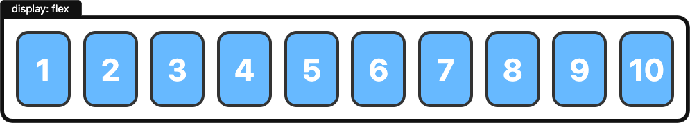
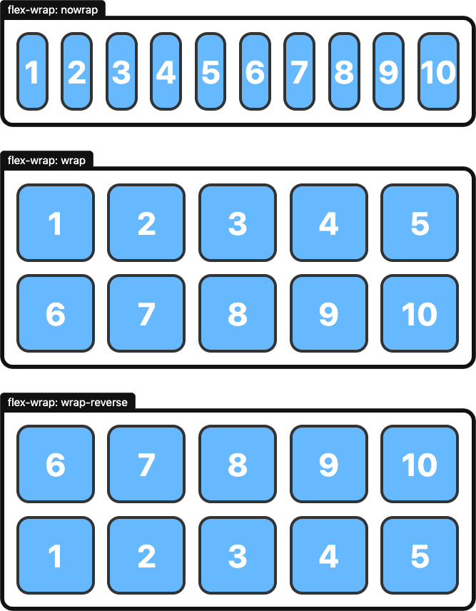
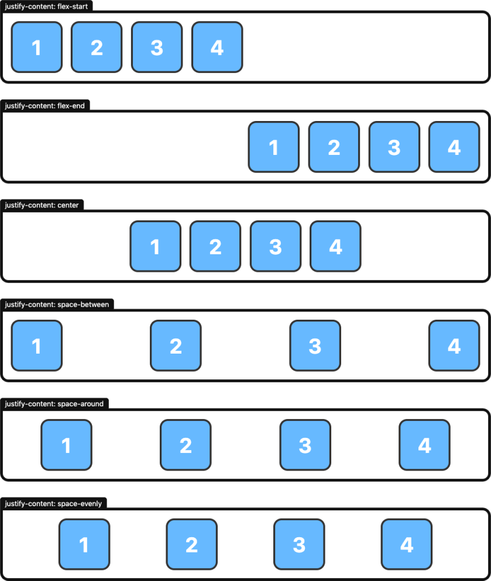
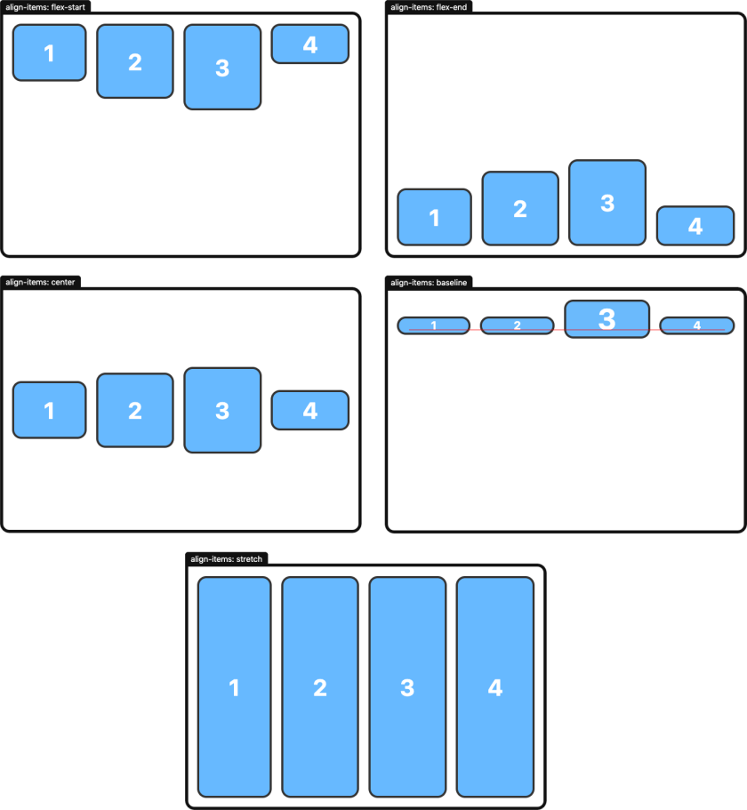

# Flex


We will not be able to create a web page by putting together all the CSS properties we have learned so far.
Because we are missing a structure that we can create the page layout we need to make a web page.

CSS offers us 2 modules to solve this problem. One of them is Flexbox and the other is Grid.
With these modules, we can arrange our page as we want.

We will learn the Flexbox module in this lesson.

Until now, we have always talked about CSS properties, but now we are talking about a CSS module. 
Because we will see multiple properties under the name of flex. And some of these properties affect the container tag, while others affect the tags inside it.

<hr>

To use Flex, we first need to add the display: flex or inline-flex; property to our container tag.
And if we have given display: flex to a tag, the elements inside the tag come side by side by default.



```
<div class="container">
    <span>Span</span>
    <p>Paragraf</p>
    <h4>Baslık</h4>
    <div>
        div
    </div>
    <button>Button</button>
</div>

.container {
    display: flex;
}
```

When we give height to the container, the heights of all the elements inside the container become equal to the height of the container.
By default, all the elements inside the container become equal to the height of the container in Flex.

```
<div class="container height">
    <span>Span</span>
    <p>Paragraf</p>
    <h4>Baslık</h4>
    <button>Button</button>
</div>


.container {
    display: flex;
}

.height {
    height: 100px;
}
```

## Flex Direction

In Flex, elements are aligned side by side by default. To change this behavior, we can use the flex-direction property.
Let's examine the values that this property can take and what they do:

- row (default) = arranges from left to right.
- row-reverse = arranges from right to left.
- column = arranges from top to bottom.
- column-reverse = arranges from bottom to top.

```
<div class="container-direction">
<!--    .box*10>{$}-->
    <div class="box">1</div>
    <div class="box">2</div>
    <div class="box">3</div>
    <div class="box">4</div>
    <div class="box">5</div>
    <div class="box">6</div>
    <div class="box">7</div>
    <div class="box">8</div>
    <div class="box">9</div>
    <div class="box">10</div>
</div>


.container-direction {
    display: flex;
    height: 100%;
    flex-direction: column;
}

.box {
    background-color: #ddd;
    width: 50px;
    height: 50px;
}
```

## Flex Wrap

If the elements do not fit into the container, flex starts compressing the elements to fit them into the available space by default.
We can use the flex-wrap property to change this default behavior.

- nowrap (default) = compresses the elements.
- wrap = moves the elements to new lines.
- wrap-reverse = moves the elements to new lines in reverse order.



```
.box {
    background-color: #ddd;
    width: 50px;
    height: 50px;
}

.container-wrap {
    display: flex;
    width: 250px;
    flex-wrap: wrap;

}
```

## Justify Content
To determine how we will hierarchically sort our elements on the horizontal axis, we use the justify-content property.
By default, our elements are sorted from left to right. We can use this property to sort our elements as we want.

- flex-start (default) = starts the elements from the left.
- flex-end = starts the elements from the right.
- center = centers the elements.
- space-between = sorts the elements with equal space between them.
- space-around = sorts the elements with equal space between them. (also leaves space between the elements and the edges of the container, half the space between the elements)
- space-evenly = sorts the elements with equal space between them. (also leaves space between the elements and the edges of the container.)




```
<div class="container-justify">
        <div class="box">1</div>
        <div class="box">2</div>
        <div class="box">3</div>
        <div class="box">4</div>
        <div class="box">5</div>
</div>

.container-justify {
    display: flex;
    justify-content: space-between;
}
```

## Align Items

To determine how we will hierarchically sort our elements on the vertical axis, we use the align-items property.

- flex-start = starts the elements from the top.
- flex-end = starts the elements from the bottom.
- center = centers the elements.
- baseline = sorts the elements according to the horizontal line of the font in the vertical axis.
- stretch (default) = sorts the elements according to the height of the container.

By default, align-items comes as stretch. If our elements do not have a certain height, they are sorted according to the height of the container.



```
<div class="container-align">
   <div>
       Ana Sayfa
   </div>
   <div>
       <input type="search" style="width: 500px; height: 25px; border-radius: 5px" placeholder="Ara">
   </div>

    <div>
        <button >Giriş Yap</button>
        <button>Kayıt ol</button>
    </div>
</div>


.container-align {
    display: flex;
    height: 75px;
    padding: 0 20px;
    background-color: #eee;
    justify-content: space-between;
    align-items: center;
}
```

## Align Content

Used to adjust the alignment of elements on the vertical axis in multi-line structures and shares the same properties with align-items.
